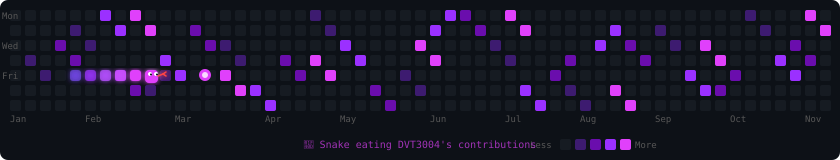

<div align="center">

</div>

<br/>

<table width="100%"><tr>
<td valign="top" width="52%">

### 🧑‍💻 Về Tôi

```java
class DVT3004 {
  String  name    = "DVT";
  String  from    = "🇻🇳 Việt Nam";
  String  badge   = "★ GitHub PRO";

  String[] code   = { "Java", "JavaScript" };
  String[] use    = { "IntelliJ", "VS Code" };

  String[] builds = {
    "☕ Quản lý cà phê (Java)",
    "📦 dvt3004.is-a.dev"
  };

  boolean  openToWork = true;
  String   funFact    = "Bug-free code? A myth 🐛";

  String motto =
    "Ship it. Learn it. Repeat. 🔥";
}
```

<br/>

**🌐 Liên kết**

[](https://github.com/DVT3004)
[](https://dvt3004.is-a.dev)
[](https://github.com/DVT3004)

</td>
<td valign="top" width="48%" align="center">


<br/>

> *"Every expert was once a beginner."*


</td>
</tr></table>

---

## ⚡ Fun Facts — Terminal

```bash
$ dvt --info

  👾  Bắt đầu code lúc... không nhớ nổi
  🐛  Bug favorite: NullPointerException (classic)
  ☕  Fuel: Cà phê · Mì tôm · Stack Overflow
  🎮  Code review = Boss fight cuối game
  🌙  Productive nhất: 11PM → 2AM
  🔥  Dòng code đầu tiên: System.out.println("Xin chào!")
  🏆  Dream: Build something that 1M người dùng

$ dvt --motto
  "Ship it. Learn it. Repeat. 🔥"
```

---

## 📊 Stats

<div align="center">


</div>

<div align="center">

</div>

---

## 🏆 Trophies

<div align="center">

[](https://github.com/ryo-ma/github-profile-trophy)

</div>

---

## 📈 Activity Graph

<div align="center">

[](https://github.com/ashutosh00710/github-readme-activity-graph)

</div>

---

## 🛠 Stack

<div align="center">


</div>

---

## 📌 Projects

<div align="center">

[](https://github.com/DVT3004/quan-ly-ca-phe-java)
[](https://github.com/DVT3004/register)

</div>

---

## 🎮 Contributions — Pick Your Game!

<div align="center">

### 🐍 Snake Mode



### 👾 PAC-MAN Mode


</div>

---

## 💬 Dev Quote of the Day

<div align="center">

[](https://github.com/piyushsuthar/github-readme-quotes)

</div>

---

<div align="center">

**⭐ Star nếu bạn thấy hữu ích — Thanks for visiting! ⭐**


</div>
