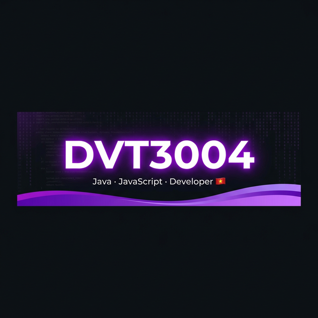

<div align="center">

<!-- Banner ảnh lưu trong repo - không phụ thuộc service ngoài -->


<br/><br/>

<!-- Badges đáng tin cậy từ shields.io -->
[](https://github.com/DVT3004)
[](https://github.com/DVT3004)
[](https://github.com/DVT3004)


</div>

---


## `< /> Giới Thiệu`

```java
public class DVT3004 extends Developer {

    String hoTen      = "DVT";
    String quocGia    = "🇻🇳 Việt Nam";
    String[] ngonNgu  = {"Java", "JavaScript"};
    String[] projects = {
        "☕ Quản Lý Cà Phê (Java)",
        "🌐 Web Development (JS)",
        "📦 is-a.dev Subdomain"
    };
    String suMenh     = "Code mỗi ngày, tiến bộ mỗi ngày 💪";
    String gioCode    = "☀️ Sáng sớm & 🌙 Đêm khuya";

    @Override
    public String toString() {
        return "Một developer đam mê & không ngừng học hỏi 🔥";
    }
}
```

<br clear="right"/>

---

## 📊 GitHub Statistics

<div align="center">


</div>

<div align="center">

[](https://git.io/streak-stats)

</div>

---

## 🛠️ Tech Stack

<div align="center">

**🔤 Languages**


**⚙️ Tools**


**📚 Đang Học**


</div>

---

## 🐍 Snake Ăn Contributions

<div align="center">

<picture>
  <source media="(prefers-color-scheme: dark)" srcset="https://raw.githubusercontent.com/DVT3004/DVT3004/output/github-contribution-grid-snake-dark.svg"/>
  <source media="(prefers-color-scheme: light)" srcset="https://raw.githubusercontent.com/DVT3004/DVT3004/output/github-contribution-grid-snake.svg"/>
  
</picture>

</div>

---

## 📌 Dự Án Nổi Bật

<div align="center">

[](https://github.com/DVT3004/quan-ly-ca-phe-java)
[](https://github.com/DVT3004/register)

</div>

---

## 🌐 Kết Nối

<div align="center">

[](https://github.com/DVT3004)
[](https://dvt3004.is-a.dev)

</div>

---

<div align="center">

<br/>


<br/>

**✨ "Mỗi dòng code là một bước tiến — Hãy code với đam mê!" ✨**

*⭐ Nếu repo của bạn hữu ích, hãy cho tôi một ngôi sao nhé!*

</div>
